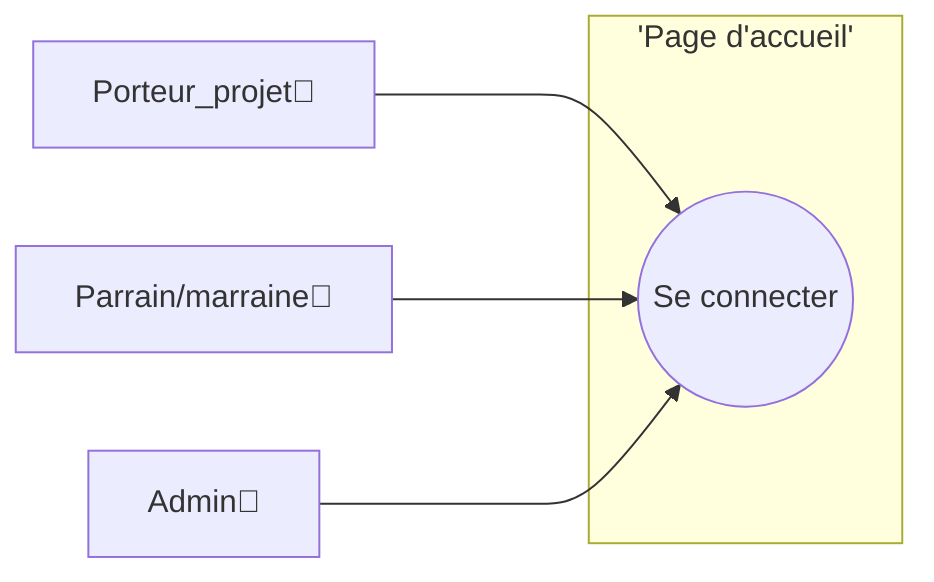
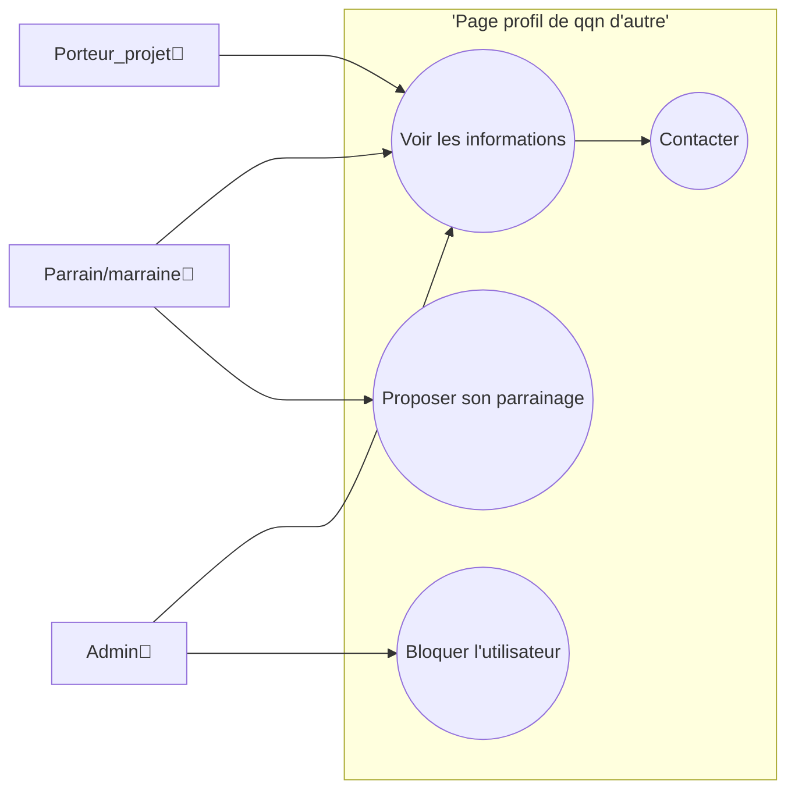
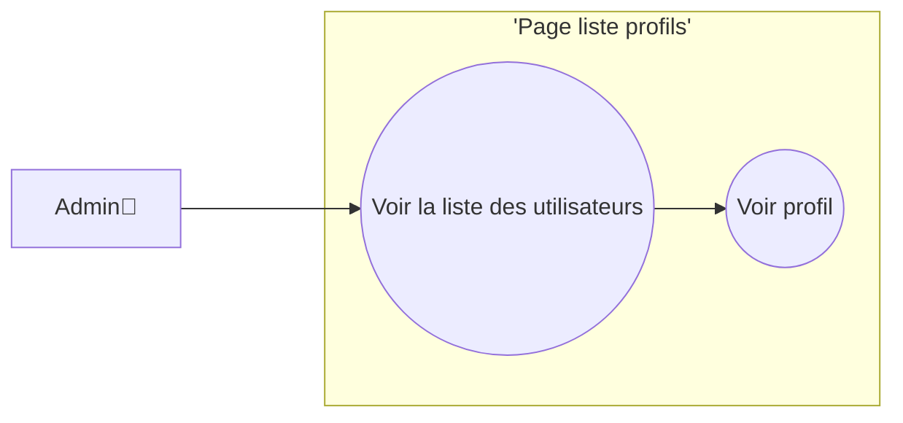
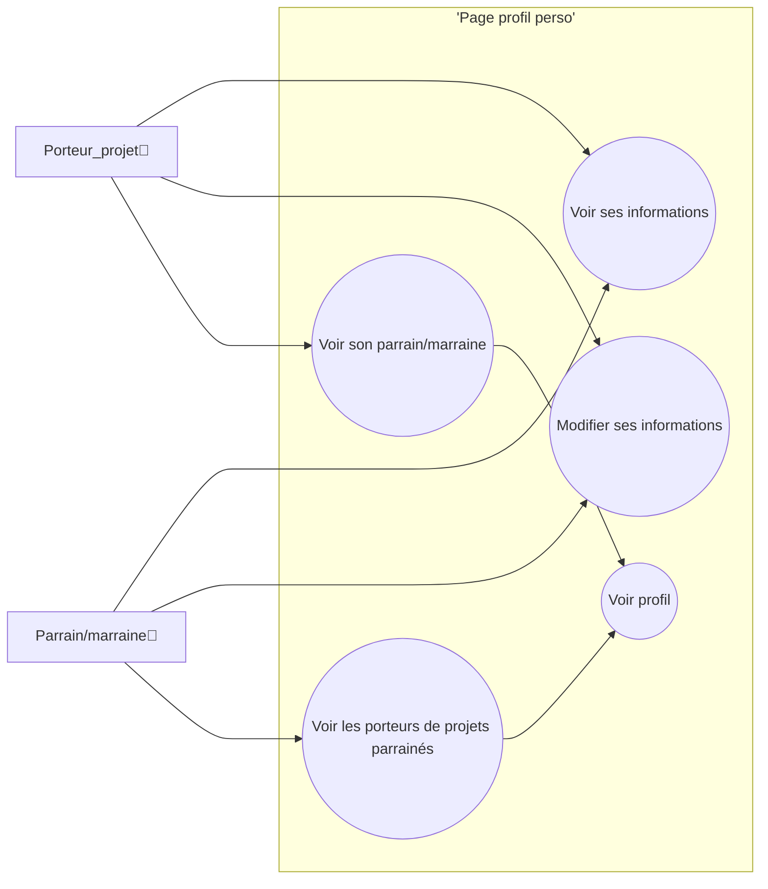
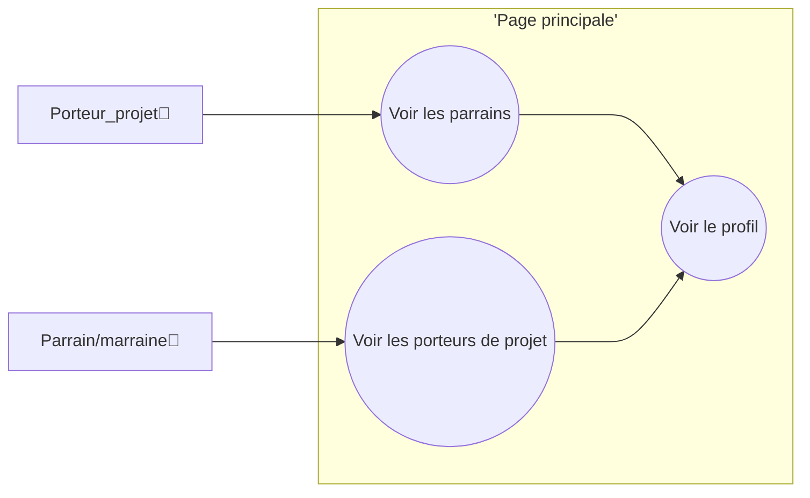
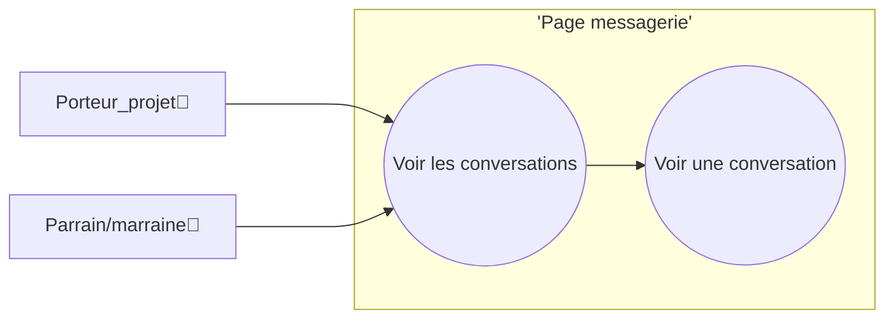
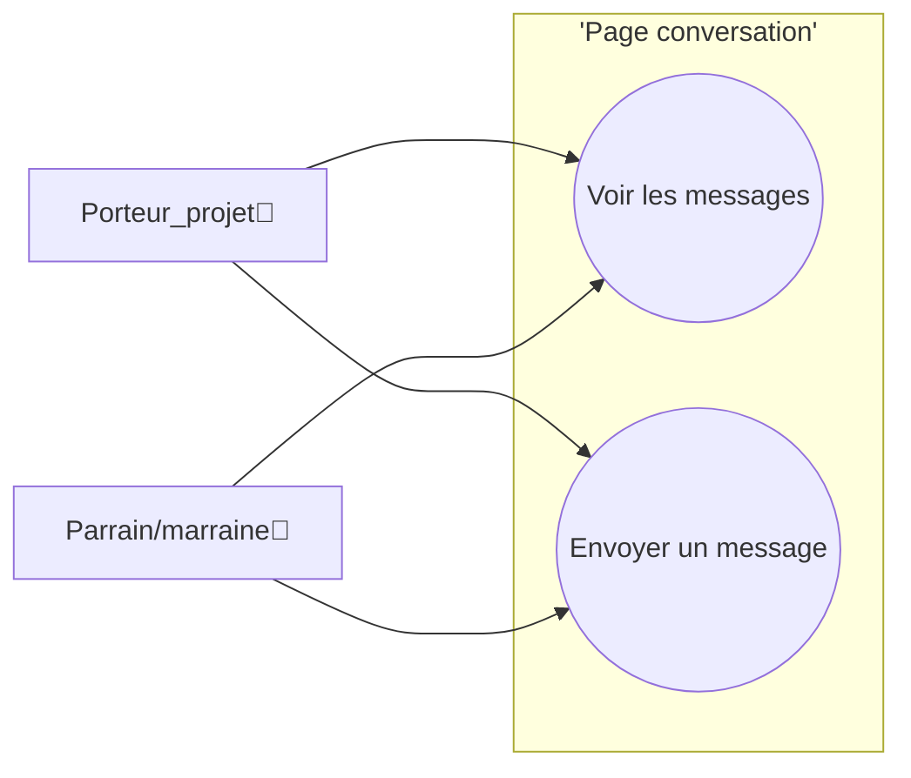
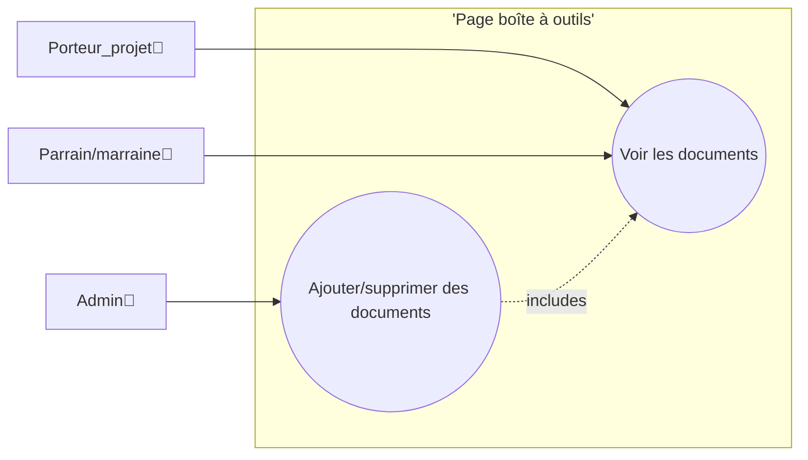

# Contexte du projet

Dans le cadre de notre projet fil rouge nous avons rencontré l'association Initiatives Deux-Sèvres. Cette association met en relation des porteurs de projet dont l'objectif est de devenir chef d'entreprise, avec des parrains/marraines qui pourraient lever les problématiques des porteurs de projet.

L'association est venue nous voir avec un projet d'application pour faciliter la mise en relation de ces deux profils et fluidifier les débuts de leur collaboration.

# Pages du projet

Vous pouvez retrouver ci-dessous une description des différentes pages à implémenter dans le projet selon moi, ainsi que les tâches qui correspondent pour les mettre en place.

## Page d'accueil

### Cahier des charges :

#### Dans la peau d'un porteur de projet

- Je dois recevoir un code d'accès ou lien pour accéder à l'application à la suite de la validation du comité
- Je dois me connecter pour accéder à l'application

#### Dans la peau d'un parrain/marraine

- Je dois me connecter pour accéder à l'application

#### Dans la peau d'un admin

- Je dois me connecter pour accéder à l'application

---

## Page profil de qqn d'autre

### Cahier des charges :

#### Dans la peau d'un porteur de projet

- Je peux voir le profil des parrains/marraines
- Je peux entrer en contacte avec un(e) parrain/marraine

#### Dans la peau d'un parrain/marraine

- Je peux voir le profil des porteurs de projet
- Je peux entrer en contacte avec un porteur de projet

#### Dans la peau d'un admin

- Je dois avoir accès aux profils des utilisateurs et voir leurs informations
- Je dois pouvoir bloquer un utilisateur

---

## Page liste de profils

### Cahier des charges 

#### Dans la peau d'un admin

- Je dois avoir une liste d'utilisateurs
- Je peux cliquer sur un utilisateur et accéder à son profil

---

## Page profil perso

### Cahier des charges :

#### Dans la peau d'un porteur de projet

- Je dois avoir accès à une page profil et voir mes informations

#### Dans la peau d'un parrain/marraine

- Je dois avoir accès à une page profil et voir mes informations

---

## Page principale : feed

### Cahier des charges :

#### Dans la peau d'un porteur de projet

- Je peux scroller parmi tou(te)s les parrains/marraines
- Je peux filtrer les parrains/marraines

#### Dans la peau d'un parrain/marraine

- Je peux scroller parmi tou(te)s les porteurs de projet
- Je peux filtrer les porteurs de projet

---

## Page messagerie

### Cahier des charges :

#### Dans la peau d'un porteur de projet

- Je peux retrouver toutes mes conversations avec les parrains/marraines
- Je peux cliquer sur une conversation pour y accéder

#### Dans la peau d'un parrain/marraine

- Je peux retrouver toutes mes conversations avec les porteurs de projet
- Je peux cliquer sur une conversation pour y accéder

---

## Page conversation

### Cahier des charges :

#### Dans la peau d'un porteur de projet

- Je peux lire les messages précédents
- Je peux envoyer un message

#### Dans la peau d'un parrain/marraine

- Je peux lire les messages précédents
- Je peux envoyer un message

---

## Page boîte à outils

### Cahier des charges :

#### Dans la peau d'un porteur de projet

- Je peux voir les documents

#### Dans la peau d'un parrain/marraine

- Je peux voir les documents

#### Dans la peau d'un admin

- Je peux voir les documents
- Je peux ajouter des documents

## Autres tâches cahier des charges :

### En tant que porteur de projet:

- Je peux recevoir une proposition de match parfait lors de ma 1ère connexion.
- Je peux filtrer les parrains/marraines dans le feed

